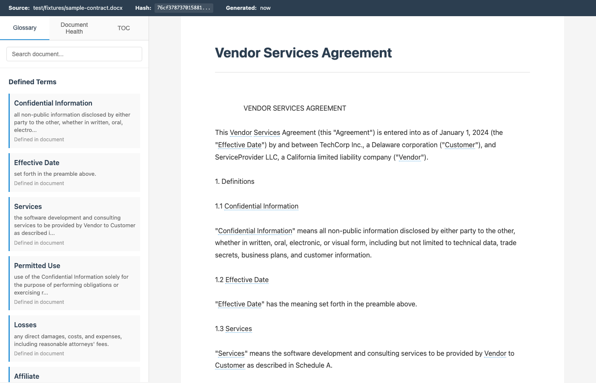
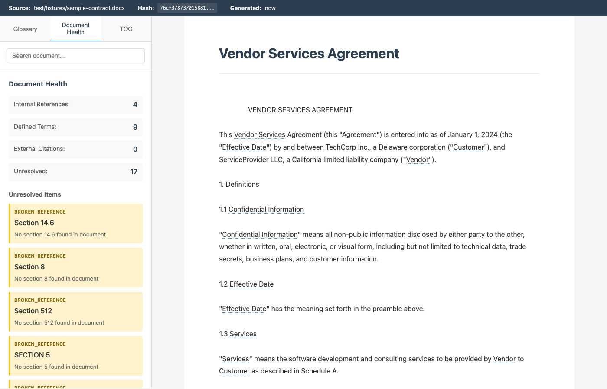

Legal documents are full of cross-references. "Subject to Section 14.6." "As defined in Schedule B." "Notwithstanding Article III." Every one forces you to stop reading, scroll to the referenced section, read it, scroll back, and try to remember where you were.

Xref fixes this. Give it a contract, statute, or regulation and it produces an interactive HTML file where every reference is hoverable. Click "Section 7.3" and the full text appears in a floating panel. Hover over "Confidential Information" and see its definition. Reference "GDPR Article 28"? The full text of Article 28 appears inline.

Nothing is rewritten or summarized. The original document text is preserved exactly. The augmentation is purely navigational.


*Interactive viewer with glossary sidebar. Defined terms are dotted-underlined throughout the document; hovering shows the definition.*

## What it does

You give Copilot a legal document (Word, PDF, or URL) and Xref produces an interactive HTML file on your Desktop where:

- Every internal cross-reference ("Section 4.2", "Article III", "Clause 7(b)(iii)") becomes hoverable. See the full text of the referenced section in a floating panel. Click "jump" to scroll to the target with a highlighted anchor, then click "back" to return.

- Every defined term ("Confidential Information", "Effective Date", "Permitted Use") becomes interactive. Hover or click to see its definition from wherever it's defined in the document.

- Every external statutory reference ("17 U.S.C. 512", "GDPR Article 28", "Data Protection Act 2018, s.34") becomes interactive with the text of the referenced provision fetched from a public legal database.

- A document health report surfaces broken references, orphaned defined terms (defined but never used), and undefined terms (used with capitalization suggesting they should be defined, but no definition found).

- A sidebar provides a glossary, unresolved items, and a table of contents.

The output is a single self-contained HTML file. Open it in any browser. No server required.


*Document health tab surfaces broken references, undefined terms, and other quality issues in the source document.*

## Installation

### Prerequisites

- [Copilot CLI](https://docs.github.com/copilot/concepts/agents/about-copilot-cli) installed and authenticated
- Python 3.8 or later

### Install the plugin

Point your CLI at this repo and ask it to install the plugin for you:

```
Install the plugin at github.com/dvelton/xref for me.
```

Or clone the repo:

```bash
git clone https://github.com/dvelton/xref.git
```

### Install dependencies

**macOS / Linux:**

```bash
cd xref
bash setup.sh
```

**Windows (PowerShell):**

```powershell
cd xref
.\setup.ps1
```

**Manual install (any platform):**

```bash
pip install python-docx pymupdf beautifulsoup4 requests lxml jinja2
```

For web URL support (optional):
```bash
bash setup.sh --web
```

### Verify setup

```bash
python3 skills/xref/tools/xref.py setup-check
```

## How to use it

In a Copilot CLI conversation, tell it to use xref:

```
use xref on ~/Desktop/vendor-agreement.docx
```

```
run xref on this contract and show me what's broken
```

```
resolve the cross-references in ~/Documents/service-agreement.pdf
```

Xref activates, parses the document, resolves all references, and generates an interactive HTML file on your Desktop.

## What it supports

| Source type | Support level |
|---|---|
| Word documents (.docx) | Primary format, most reliable parsing |
| PDF files (.pdf) | Supported, uses font-size heuristics for section detection |
| Web pages (URLs) | Requires Playwright (install via `bash setup.sh --web`) |

| Citation type | Support |
|---|---|
| US Code | Fetched from uscode.house.gov |
| CFR (Code of Federal Regulations) | Fetched from eCFR |
| GDPR | Pre-bundled (all 99 articles) |
| UK legislation | Fetched from legislation.gov.uk |
| EU regulations | Fetched from eur-lex.europa.eu |

## How it works

1. Xref parses the document to extract its section structure using Word heading styles (for .docx) or font-size heuristics (for PDF)
2. It identifies all cross-references using regex patterns for common legal reference formats
3. It extracts defined terms using a 5-step priority algorithm (definitions section, inline quotations, parentheticals, section-scoped definitions, capitalization patterns)
4. It resolves each reference to its target section, handling ambiguity with preference order: exact match > case-insensitive match > numeric equivalent
5. For external statutory citations, it fetches the text from public legal databases with local caching and retry logic
6. It assembles an interactive HTML file with all CSS and JavaScript inlined. Every reference, term, and citation becomes a hoverable element with pre-rendered panels for instant display.
7. The output lands on your Desktop

## Features

**Interactive elements:**
- Internal cross-references: blue underline, hover shows full section text, click to jump
- Defined terms: dotted underline, hover shows definition and scope
- External citations: green underline with arrow icon, hover shows statute text
- Unresolved references: color-coded by type (wavy red for broken, wavy orange for undefined terms, dotted gray for external docs)

**Sidebar:**
- Glossary tab: alphabetical list of all defined terms
- Document health tab: statistics and unresolved items grouped by type
- TOC tab: hierarchical table of contents with jump links
- Search: searches document text, term names, and section headings

**Navigation:**
- Jump to section with back button
- Navigation stack using URL hash fragments (browser back/forward works)
- Keyboard shortcuts: Escape (close panel), n/N (next/previous unresolved), g (glossary), h (health), t (TOC), s or / (search)

**Document provenance:**
- Source filename and SHA-256 hash
- Generation timestamp
- Verifiable against original document

**Print mode:**
- Defined terms get parenthetical definitions on first use
- Cross-references get per-page footnotes
- External citations get endnotes with source URLs

**Compact mode:**
- Use `--compact` flag to omit external statute text for smaller file size
- Internal references and defined terms always fully embedded

## Limitations

- PDF parsing uses font-size heuristics and is less reliable than Word document parsing. The parser flags uncertain regions in its output.
- Scanned PDFs without a text layer are not supported. Use OCR software first or provide a Word version.
- External citation support is limited to the jurisdictions listed above. Unsupported citation formats are rendered as plain text with a note in the document health report.
- Very large documents (500+ pages) will produce large HTML files. Use `--compact` mode if file size is a concern.

## License

MIT
